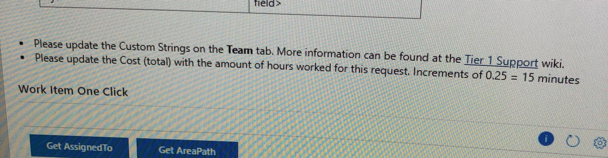

The fields in the VSO Task Items that need to be enforced are:
* Custom String 01: Request Team
  * Cannot be empty
  * Must be one of these values:
    * Build
    * Packaging
    * PVT
* Custom String 02: Request Type
  * Cannot be empty
  * Must be one of these values
    * Tier 1 Request
    * Targeted Build Request
* Custom String 03: Toil Category

<https://www.aspsnippets.com/Articles/Send-SMTP-email-using-Console-Application-in-C-and-VBNet.aspx>

<https://osgwiki.com/wiki/Creating_Tools_to_Use_VSO#VSTS_Rest_API.27s>

Cost

And I think start and due date

Anything that has a lookup value?

No

So custom string 1, 2, and 3 are free form - you can type anything in them?

Yes, we have a list of things in a wiki page

But people know how to find that

So we don’t need to include what they need to fill out in the email, just let them know that which ones are missing

Is Cost a dollar amount?

No

Cost of time

0.25, 0.50, 0.75, or 1

Just increments by 0.25

Is there a drop-down to select which value?

No

Up/down arrows? Or just type it in?

Type it in

OK. Are there any more screen shots (from the WIKI, I presume) that you can send me?

Oh - and are start and end dates calendar controls?

Yes

I’m working on the API right now, so I would also like to configure the test environment to match the real one (the same custom fields and such).

Something to try - type in something other that .25, .5, .75, or 1 in the cost field and see what happens. Not just numeric values; try something like ‘ABC’. The reason is so I can figure out what kind of backing field it has (i.e. string, numeric, etc.)

Why do we need to figure that out?

It matters to the API.

Even to just check if the field is empty or not?

Yes.

An empty numeric field could have a value of zero, while an empty string field has a value of ‘’ (empty string), not NULL.

Didn’t like that

If you hover over the exclamation point (or click on it), what does it tell you?

It didn’t tell me anything

OK. But it does show an error icon. What if you type in something like .37, or 5?

No error message

I can type in .37

No !

?

It doesn’t have the ! Error

When I type in .37

Try a value > 1 and another < 0 (negative number) and see if either of those work.

Greater than 1 works

Negative number works too

OK. I think that tells me what I need to know. Thanks.